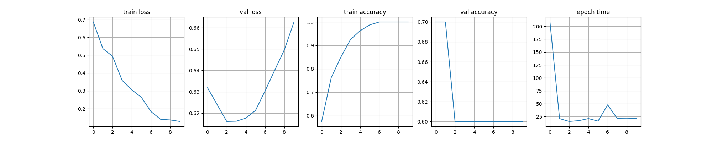
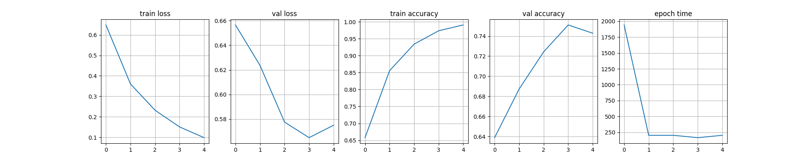

# Bone-Fracture-Classification-and-Detection

This project has for goal to compare the methods used, in the literature, to classify radiography images presenting bones in order to detect a potential condition (mainly fractures).

## Models
The most popular methods used for this type of problem are CNNs able to recognize patterns in an image, thus allowing and easy recognition of a potential condition. 
The CNNs tested here are DenseNet-201 and Inception-ResNet-v2. Both of these models have been trained on the same dataset, MURA.

## Dataset
For this project, radiographies of bones, healthy and abnormal were needed to be able to train the models and classify them. In the litterature, the MURA dataset seemed to be well used.  
This dataset was created by Stanford University for a classification contest. It regroups more than 40 000 radiographies from 14665 studies split into a training and a validation set. 
The test set of the contest was not available as of the time this project was impemented so the training and validation set were merged, in a first time, and split in three sets: training (80%) validation (10%) and test (10%)

## Method
The same method was used on both the models presented in order to compare their respective performances : learning rate =  1e-5, epochs = 10, loss = binary crossentropy
The experiment was conducet three times wit a different number of images (100,3000 and 10000 images) to see the impact of the number of data.
Sadly, the experiment using the whole dataset wasn't possible because of the limitations of the machine used for the training. 

## Results

### 100 images
Here are the graphs obtained during the training:

Densenet201:

Inception-resnet-v2:

Here are the results for the test set:

||Time|accuracy|
|---|:---:|:---:|
|DenseNet201|0.5s|70%|
|Inception ResNet v2|0.18s|60%|

### 3000 images 
Densenet201:

Inception-resnet-v2:

||Time|accuracy|
|---|:---:|:---:|
|DenseNet201|91s|68%|
|Inception ResNet v2|3s|60%|

### 10 000 images
 
Densenet201:

Inception-resnet-v2:

||Time|accuracy|
|---|:---:|:---:|
|DenseNet201|242s|81%|
|Inception ResNet v2|10s|70%|

## Discussion

As we can see on the graphs, the result of loss function is increasing back meaning that the models start to face an overfitting problem. 

We can also see an increase of accuracy when using more images. These numbers are still lower than the ones found in the litterature but we can imagine that using the whole dataset, the accuracy will get closer. 
